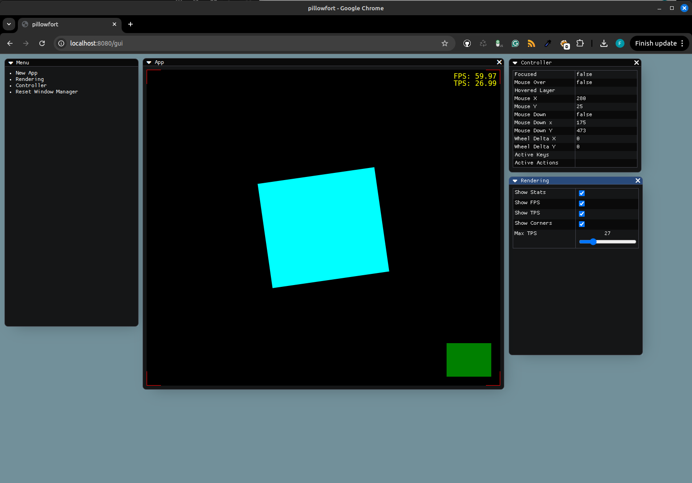

# pillowfort

pillowfort is a simple web based 2D game engine, geared towards creating
multi-player experiences. It comes with its own rendering pipeline, tileset-
and map editor, and [ImGui](https://github.com/ocornut/imgui) inspired GUI
framework to create custom tools.




## Getting Started
```
$ make data-bootstrap
$ make start
```


## Run Tests
```
$ make test
```
